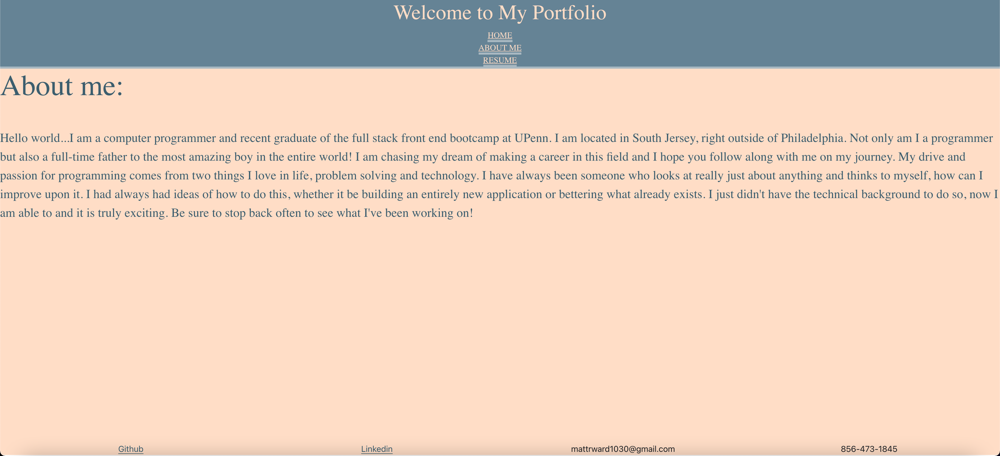
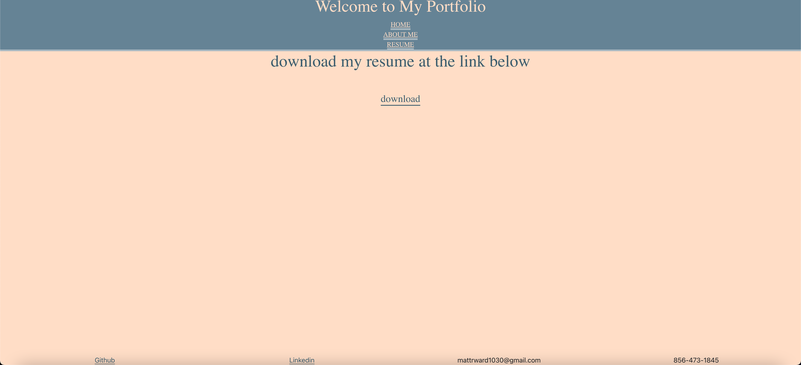

# react-portfolio

# Portfolio

## Description 

The goal of this project was to refactor our portfolio and bring it up to speed with the new frameworks we have been working with. This may look very similar to my bootstrap only portfolio but there is a lot more going on under the hood. This webpage is powered by react and it is responsible for all of the modularizing of the webiste and how it is broken down into different componenets. This lends itself well to resuablity, when I need to update this in the future it will be much easier. For the layout of the webpage I decided to use bootstrap as it is the CSS framework I have the most experience with and know I could get the most out of it. The finished site was to have a polished look which is accomplished, the site is modern and clean, giving this portfolio a great look. It has a mobile first design so it looks good on any viewport and easy to read font and colors that do not cause eyestrain to the user. Tried to take a modern, simplistic approach when styling the webpage. It has all the links that you would expect from a computer programmer, including github, linkedin and showcases all of the projects that I am proud of doing. Overall this portfolio has a good approachable design that lays out all the appropriate things a good portfolio should.

## Installation 

To install this repo on your local drive you would have to clone the ssh key from my repo. Head into your local drive of choice in terminal or bash and do a git clone. Once you have done a git clone you are free to start working on this project. If you want to push your changes to my repo then you would have to head into terminal/bash and do a git add . Then a git commit -m explaning the changes made, and finally a git push to push the files onto the repo. 

## Finished project

Check out the live application on <a href=https://mattrward1030.github.io/react-portfolio/#/>Github pages!</a>

 ### My portfolio

 
 
 

 

## Features
<ul>
<li> A portfolio powered by React.js.</li>
<li> Every component on the page has its own file, lends itself to better reusablitiy.</li>
<li> Laybout built using CSS Bootstrap.</li>
<li>Displays full name.</li>
<li>In the footer there is links to my github, linkedin, email and phone number</li>
<li>Downloadable PDF link to my resume in the resume page.</li>
<li>Displays 6 of my recent projects, all pictures are clickable and take user to deployed application.</li>
<li>Each image contains a figcaption which is a link to the github repo of each project.</li>
<li>This application has clear readble font and colors that do not cause the user eyestrain.</li>
<li>Feautures a mobile first design that responds to any viewport size.</li>
<li>A somewhat detailed about me that gives a quick intro to who I am and why I am chosing this career path.</li>
<li>Site hosted live on <a href=https://mattrward1030.github.io/react-portfolio/#/>Github pages!</a> </li>

</ul>

## Tests
N/A

## Credits
N/A

## Contributing

Pull requests are welcome and encouraged. Hit me up on my github <a href="https://github.com/mattrward1030">mattrward1030</a>

## Badges
 

## License

MIT License

Copyright (c) [2021] [Matthew Ward]

Permission is hereby granted, free of charge, to any person obtaining a copy
of this software and associated documentation files (the "Software"), to deal
in the Software without restriction, including without limitation the rights
to use, copy, modify, merge, publish, distribute, sublicense, and/or sell
copies of the Software, and to permit persons to whom the Software is
furnished to do so, subject to the following conditions:

The above copyright notice and this permission notice shall be included in all
copies or substantial portions of the Software.

THE SOFTWARE IS PROVIDED "AS IS", WITHOUT WARRANTY OF ANY KIND, EXPRESS OR
IMPLIED, INCLUDING BUT NOT LIMITED TO THE WARRANTIES OF MERCHANTABILITY,
FITNESS FOR A PARTICULAR PURPOSE AND NONINFRINGEMENT. IN NO EVENT SHALL THE
AUTHORS OR COPYRIGHT HOLDERS BE LIABLE FOR ANY CLAIM, DAMAGES OR OTHER
LIABILITY, WHETHER IN AN ACTION OF CONTRACT, TORT OR OTHERWISE, ARISING FROM,
OUT OF OR IN CONNECTION WITH THE SOFTWARE OR THE USE OR OTHER DEALINGS IN THE
SOFTWARE.
